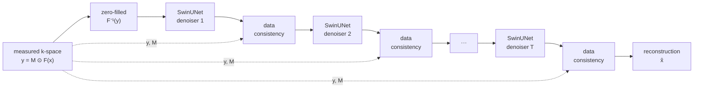

<div align="center">

# Lucid

### Physics-informed accelerated MRI reconstruction

*Recovering diagnostic-quality images from undersampled k-space with a hierarchical
Swin Transformer, constrained at every step by the physics of the acquisition.*

[](https://www.python.org/downloads/)
[](https://pytorch.org/)
[](#testing)
[](#testing)
[](paper/paper.pdf)
[](LICENSE)

**[Paper](paper/paper.pdf)** · **[Quick start](#quick-start)** · **[Results](#results)** ·
**[Architecture](#architecture)** · **[Model card](MODEL_CARD.md)** · **[The audit](#the-audit-what-changed-in-v2)**

</div>

---

MRI is diagnostically invaluable and slow to acquire. **Lucid** collects only a
fraction of the raw frequency-domain data (k-space) and reconstructs a
full-quality image from it, cutting scan time proportionally.

The distinguishing feature is that reconstruction is **not** treated as generic
image restoration. We know exactly which Fourier coefficients the scanner
measured, so an unrolled *data-consistency* cascade restores them after every
learned refinement. The network can only ever modify frequencies that were never
acquired — the constraint that separates reconstruction from plausible-looking
inpainting.

> **Headline finding.** In a capacity-matched ablation, that constraint is worth
> **+2.40 dB** on a U-Net and **+2.16 dB** on a SwinUNet — both at *p* < 10⁻⁴, and both
> with **fewer** parameters than the single-pass controls they beat. Two architectures with
> very different inductive biases agreeing to within 0.24 dB points at the physics, not
> the network. → [Results](#results)

This repository is also the artifact of a **reproducibility audit I ran on my own earlier
work**. I had considered v1 of this project finished; it turned out not to run at all. Its
flagship model could not be *constructed* at its own documented configuration, and its
data-consistency module was never given data. Everything here is rebuilt from that audit,
verified numerically, and tested.
→ [The audit](#the-audit-what-changed-in-v2)

---

## Quick start

```bash
git clone <repository-url> && cd Lucid
python -m venv .venv && .venv\Scripts\activate      # Linux/macOS: source .venv/bin/activate
pip install -e ".[dev,tracking,export]"
```

**Verify every architecture builds and runs — no data required:**

```bash
python main.py test_models
```

**Train end to end without downloading anything** (a few minutes on CPU):

```bash
python scripts/make_synthetic_data.py --out data/synthetic --volumes 16
python main.py train --config configs/smoke.yaml data.train_dir=data/synthetic
```

That single command exercises the entire path — undersampling, complex I/O, the unrolled
data-consistency cascade, AMP, EMA, checkpointing and metrics. If something is broken, it
fails in seconds rather than at hour three of a real run.

For real experiments see [`data/README.md`](data/README.md) to obtain fastMRI, then:

```bash
# Strongest configuration: SwinUNet + unrolled data consistency
python main.py train --config configs/swinunet_dc.yaml

# Image-domain baselines
python main.py train --config configs/swinunet.yaml
python main.py train --config configs/unet.yaml
python main.py train --config configs/bt_unet.yaml

# Override anything from the CLI (dot notation, schema-validated)
python main.py train --config configs/swinunet.yaml training.lr=5e-5 data.acceleration=[4,8]

# Resume exactly where a run stopped — optimiser, scheduler, EMA, patience, best score
python main.py train --config configs/swinunet.yaml --resume outputs/swinunet/checkpoints/last.pt
```

**Evaluate, compare, benchmark, export:**

```bash
python main.py eval      --ckpt outputs/swinunet_dc/checkpoints/best.pt
python main.py compare   --ckpt_dir outputs          # with significance tests
python main.py benchmark --ckpt outputs/swinunet_dc/checkpoints/best.pt
python main.py export    --ckpt outputs/swinunet/checkpoints/best.pt --format onnx
python main.py curves    --run outputs/swinunet_dc
```

Every command returns a non-zero exit code on failure. This is not a detail: my v1
`test_models` caught every exception, printed `FAIL` into a table, and exited 0 — so CI
stayed green while nothing worked.

---

## How it works

Undersampled measurements arrive as `y = M ⊙ F(x)`. The zero-filled reconstruction
`F⁻¹(y)` is aliased; the network's job is to fill in what was never measured — and
*only* what was never measured.



Each data-consistency step is a projection back onto the measurements:

```
k_pred     = F(x_pred)
k_dc[m=1]  = λ·k_measured + (1−λ)·k_pred     # trust the scanner
k_dc[m=0]  = k_pred                          # network fills the gaps
x_dc       = F⁻¹(k_dc)
```

`λ` is learnable and initialised at hard consistency. One `denoiser → DC` pair is a single
iteration of a proximal-gradient solver whose proximal operator has been *learned*;
`CascadedNet` unrolls `n_cascades` of them.

Data consistency requires phase, so it forces complex (2-channel) I/O. Config validation
enforces this rather than silently degrading — as does the requirement that undersampling
happen in the cropped domain, without which writing coefficients back is mathematically
invalid.

---

## Results

A controlled ablation on **synthetic phantoms**: 60 training volumes (240 slices) and 20
held-out validation volumes (80 slices), split at the *volume* level, R = 4 random
Cartesian undersampling with an 8% fully sampled centre, 128×128 crops, 30 epochs,
identical optimiser settings, 3 seeds, median-SSIM seed reported. Reproducible end to end
with no download.

### Data consistency vs. a capacity-matched control

This is the comparison that tests the hypothesis. Both members of each pair are
complex-valued and differ *only* in whether measured k-space is projected back after each
refinement.

| Backbone | Cascade | Control | ΔPSNR | 95% CI | *p* |
|---|---:|---:|---:|:---:|:---:|
| U-Net | **36.95 dB** | 34.54 dB | **+2.40** | [+2.16, +2.65] | <10⁻⁴ |
| SwinUNet | **32.70 dB** | 30.54 dB | **+2.16** | [+1.98, +2.35] | <10⁻⁴ |

Both cascades have **fewer** parameters than the single-pass controls they beat
(0.97 M vs 1.00 M; 0.42 M vs 0.46 M), so the gain isn't capacity. A cascade of *T* stages
has *T* times its backbone's parameters, and attributing its gain to physics without
controlling for that would repeat — in subtler form — the error this project set out to
correct.

### The full ladder

| Configuration | Params | PSNR | SSIM | NMSE |
|---|---:|---:|---:|---:|
| Zero-filled (no network) | — | 29.48 | 0.7563 | 0.01393 |
| U-Net, magnitude | 0.48 M | 36.23 | 0.9673 | 0.00301 |
| U-Net, complex | 0.48 M | 34.09 | 0.9284 | 0.00491 |
| U-Net, complex, wide | 1.00 M | 34.54 | 0.9400 | 0.00442 |
| **U-Net + DC cascade** | 0.97 M | **36.95** | 0.9441 | **0.00270** |
| SwinUNet, magnitude | 0.21 M | 29.86 | 0.8941 | 0.01274 |
| SwinUNet, complex, wide | 0.46 M | 30.54 | 0.9086 | 0.01089 |
| **SwinUNet + DC cascade** | 0.42 M | **32.70** | 0.9146 | **0.00682** |

Two things worth reading carefully:

**Complex input on its own *costs* 2.14 dB** (36.23 → 34.09, at identical parameter
count). The loss is computed on magnitude, so phase is entirely unsupervised and the
network optimises through a large null space — infinitely many complex outputs share the
same magnitude, and nothing in the objective distinguishes them. Doubling capacity
recovers only 0.46 dB of it. Data consistency recovers *all* of it and adds 0.72 dB beyond
the magnitude baseline, because it is the only component that reaches phase: it operates
in k-space, where phase isn't optional.

**The SwinUNet arm is under-trained**, and is reported as such. It sits below the U-Net at
every rung — 6.4 dB at the magnitude baseline, and 4.0–4.3 dB once both are complex-valued. That is a statement about 240 synthetic training slices and 0.21 M
parameters, not about the architecture — transformers lack the locality prior that lets a
CNN learn from small data. This ablation establishes the DC effect on both backbones and
establishes **nothing** about their relative merits.

### The physics operators, verified

Before any model comparison, the operators themselves are checked. These assertions run in
the test suite on every commit.

| Property | Measured |
|---|---:|
| Fourier round-trip error, ‖F⁻¹F x − x‖∞ | 9.5 × 10⁻⁷ |
| Hard-DC measured-line error, ‖(F x̂ − y) ⊙ M‖∞ | 8.3 × 10⁻⁷ |
| Unmeasured frequencies altered by DC | 0 (exact) |
| λ when 1.0 is requested — *original* | 0.7311 |
| λ when 1.0 is requested — *corrected* | 0.9999 |

A broken data-consistency layer still trains, still produces a falling loss curve, and
still generates plausible images. Only an exactness assertion detects it.

### Architectural cost

At 320×320, single-image batch, CPU reference. Median rather than mean: latency
distributions are right-skewed, so a mean over 100 runs is dragged upward by a handful of
outliers.

| Model | Params | Median latency | p95 |
|---|---:|---:|---:|
| U-Net (32, 4 levels) | 7.76 M | 182.0 ms | 203.1 ms |
| BT-UNet (32, 4 levels) | 20.58 M | 250.9 ms | 289.9 ms |
| **SwinUNet (64, 3 levels)** | **12.95 M** | **144.1 ms** | **172.5 ms** |

The SwinUNet is both smaller and faster than the BT-UNet, because its attention is
windowed rather than global — the same property that makes it scale to higher resolutions.

### What is deliberately not claimed

**No fastMRI benchmark numbers are quoted, and no trained weights are shipped.** My v1
figures are not reproducible from the v1 code, and the corrections to the sampling mask
and metric definitions mean numbers produced under that protocol are not comparable to
numbers produced under this one. Carrying my own earlier figures forward as validated
would be the same error over again. The tooling to regenerate them under a stated, automatically
checked protocol is what ships instead.

### Reproducing

```bash
# Synthetic ablation (~2 h on CPU) — no download required
python scripts/make_synthetic_data.py --out data/exp/train --volumes 60 --slices 4
python scripts/make_synthetic_data.py --out data/exp/val   --volumes 20 --slices 4 --seed 999

# fastMRI benchmark
for cfg in unet bt_unet swinunet swinunet_dc; do
    python main.py train --config configs/$cfg.yaml
done
python main.py compare --ckpt_dir outputs --metric psnr --reference unet_baseline
```

`compare` prints percentile bootstrap confidence intervals (10,000 resamples) and
Holm-corrected paired permutation tests (10,000 sign flips), so the output states whether
a difference is *resolvable* — not merely which number is larger. Every run writes
`history.json`, `summary.json` and a `manifest.json` recording the git commit, whether the
tree was dirty, the PyTorch version and the GPU model, so any reported number is traceable
to the exact state that produced it.

The full write-up — the audit, the corrected methodology, the ablation and its
interpretation — is in **[`paper/paper.pdf`](paper/paper.pdf)** (24 pages; LaTeX source
alongside, rebuild with `paper/build.sh`). Intended use, factors and limitations are in
**[`MODEL_CARD.md`](MODEL_CARD.md)**. Figures and per-slice distributions can be
regenerated from [`notebooks/results_visualizations.ipynb`](notebooks/results_visualizations.ipynb).

---

## Architecture

### SwinUNet (primary)

A hierarchical Swin Transformer in a U-Net encoder–decoder:

- **Patch embedding** — non-overlapping patches projected to `embed_dim`.
- **Shifted-window attention** — attention within `ws × ws` windows, alternating regular
  and shifted partitioning. Cost is **O(n)** in image area rather than O(n²), which is
  what makes 320×320 feasible.
- **Patch merging / expanding** — hierarchical down- and upsampling.
- **Skip connections** — encoder features fused at each decoder scale.
- **Global residual** — predicts a correction to the zero-filled input, with a
  zero-initialised output layer so training begins from the exact identity.

Feature maps are padded to the window size, so any input resolution works and one trained
model runs at any size. (The absence of that padding is what made my v1 model
unconstructable at its own documented config.)

### Baselines

- **U-Net** — 4 levels, InstanceNorm + LeakyReLU. `NormUNet` adds the fastMRI
  instance-normalisation wrapper for exact scale equivariance.
- **BT-UNet** — U-Net with a Transformer encoder at the bottleneck. Positional embeddings
  interpolate to any bottleneck grid.

All four backbones (`unet`, `norm_unet`, `bt_unet`, `swinunet`) are built through
`models/registry.py` — one place that knows how to construct a model, so a checkpoint
always rebuilds the architecture that wrote it.

---

## Configuration

Precedence: `configs/default.yaml` → experiment YAML → programmatic → CLI.

```yaml
model:
  name: swinunet
  complex: true
  params: { embed_dim: 48, ws: 8, n_levels: 3 }
  data_consistency: { enabled: true, mode: cascade, n_cascades: 4 }

data:
  acceleration: [4, 8]          # one model across both factors
  undersample_domain: cropped   # required for exact DC

training:
  epochs: 50
  lr: 4.0e-5
  monitor: val_ssim
  monitor_mode: max
```

Configs are validated on load. **Unknown keys are errors, not silent no-ops** — a typo'd
`learning_rate` that quietly keeps the default is indistinguishable from a successful
override until you compare two runs and find them identical. Cross-field constraints are
checked too: enabling data consistency with full-FOV undersampling is rejected, because
the projection would be invalid.

| Config | Purpose |
|---|---|
| `configs/default.yaml` | Every default, documented inline |
| `configs/swinunet_dc.yaml` | **Strongest**: SwinUNet + 4-stage DC cascade, R ∈ {4, 8} |
| `configs/swinunet.yaml` | Image-domain SwinUNet |
| `configs/unet.yaml` | U-Net baseline |
| `configs/bt_unet.yaml` | Transformer bottleneck |
| `configs/smoke.yaml` | Minutes-long end-to-end test |

---

## Training features

| Feature | Notes |
|---|---|
| Data consistency | Unrolled cascade; measured k-space restored every stage |
| Mixed precision | bf16 preferred; FFTs and metrics forced to fp32 |
| EMA | Validated *and* checkpointed on the averaged weights |
| Per-step LR schedule | Warmup resolved in steps, not epochs |
| Multi-acceleration | Train once across R ∈ {4, 8}, reported per factor |
| Gradient accumulation | Decouples effective batch from memory |
| Losses | L1 / Charbonnier, SSIM, k-space frequency, Sobel edge, VGG perceptual |
| Checkpointing | Top-k *by monitored metric*, plus `best.pt` and `last.pt` |
| Resume | Optimiser, scheduler, scaler, EMA, patience and best score |
| Reproducibility | Seeded per (seed, epoch, worker, index); manifest records git SHA and hardware |
| Failure analysis | Worst-slice reporting and per-acceleration breakdown |

---

## Deployment

```python
from inference import MRIReconstructionPipeline

pipe = MRIReconstructionPipeline.from_checkpoint("outputs/swinunet/checkpoints/best.pt")

recon = pipe.reconstruct(zero_filled_image)
recon = pipe.reconstruct(zero_filled_image, tta=True)             # dihedral averaging
mean, std = pipe.reconstruct_with_uncertainty(zero_filled_image)  # MC dropout

pipe.export_onnx("exports/swinunet.onnx")   # numerically verified against PyTorch
```

A data-consistency model needs the measurements, not just the aliased image — so it takes
the k-space entry point, which mirrors the training-time simulation exactly. Passing one a
bare image raises with an explanatory message rather than quietly reconstructing without
physics:

```python
dc = MRIReconstructionPipeline.from_checkpoint("outputs/swinunet_dc/checkpoints/best.pt")
out = dc.reconstruct_from_kspace(kspace, acceleration=4)   # -> reconstruction, zero_filled, mask, scale
```

Exports are numerically verified against the PyTorch model before being written; an export
that silently produces a *different* model is more dangerous than one that fails outright.

**Docker:**

```bash
docker build -t lucid-mri .                                    # CUDA runtime
docker build -t lucid-mri-cpu --build-arg BASE=ubuntu:22.04 .  # CPU only
docker run --gpus all -v ./data:/app/data -v ./outputs:/app/outputs \
    lucid-mri train --config configs/swinunet_dc.yaml
```

---

## Testing

```bash
pytest tests/ -q                    # 270 tests, under a minute on CPU, 88% coverage
pytest tests/ --cov --cov-report=term
pytest tests/test_physics.py -v     # Fourier and data-consistency exactness
```

Every defect the audit found in v1 has a corresponding regression test. The suite covers:

- **Physics exactness** — Fourier round-trip and unitarity; DC restoring measured
  coefficients; DC leaving unmeasured coefficients untouched; a perfect estimate being a
  fixed point; a cascade's final output still agreeing with the measurements.
- **Construction** — SwinUNet builds and runs at 1–4 levels and at arbitrary, including
  odd, resolutions.
- **Silent-failure regressions** — EMA actually swapping weights; EMA state loading by
  name; the DC wrapper *raising* rather than skipping when given no measurements; λ
  meaning what it says.
- **Measurement** — per-image vs. batch PSNR; mask acceleration accounting; metrics
  computed in fp32.
- **Integration** — full training runs against real HDF5 volumes, with and without data
  consistency, plus resume fidelity.

Testing against real HDF5 files rather than mocks is deliberate. Every model test in my v1
suite passed, because none of them ever loaded a file — and the data-consistency path,
which fails only when data flows through it, was never exercised.

CI runs four jobs on every push: `ruff` lint, the test matrix on Python 3.10/3.11/3.12, an
architecture sanity forward pass, and an end-to-end training smoke test that generates
synthetic data, trains, verifies the run artifacts exist, and evaluates the checkpoint.

---

## The audit: what changed in v2

I wrote v1, considered it done, and later audited it. It could not run: three independent
defects made every documented entry point fail. Everything below is my own code, found by
auditing it rather than by being told.

| Defect | Consequence |
|---|---|
| `SwinUNet` reshaped windows without padding | At the documented config (320 px, patch 4, 3 levels, window 8) stage 3 is 20×20 and 20 % 8 ≠ 0. Construction raised `RuntimeError`, so **the headline model never ran**. |
| `utils/reproductibility.py` misspelled | `utils/__init__.py` imported `utils.reproducibility`, so importing `training` raised `ModuleNotFoundError`. |
| `from_checkpoint` / `_build_model` missing decorators | Plain functions on the class; `from_checkpoint(path)` bound `path` to `cls`. Every inference, benchmark and export path raised immediately. |

<details>
<summary><b>And sixteen more that ran, but produced wrong or meaningless results</b> (click to expand)</summary>

<br>

| Defect | Consequence |
|---|---|
| `EMAModel.average_parameters` lacked `@contextmanager` | The body never executed; validation silently used raw training weights. |
| EMA wrote `shadow`, loaders read `shadow_params` | EMA weights were never loaded anywhere, silently. |
| `ResidualDCWrapper` skipped DC when k-space was `None` | The trainer only ever passed the image, so `data_consistency.enabled: true` was a **complete no-op**. |
| DC returned `x.abs()` | Phase discarded, so cascading was impossible. |
| `sigmoid(lambda_init)` | A requested hard consistency of 1.0 became 0.73 — a silent 27% leak of network output into measured frequencies. |
| `equispaced_mask` added the centre on top of `mask[::R]` | Effective acceleration 3.2× at a nominal 4× — a 19.3% denser acquisition than reported. |
| PSNR averaged MSE across the batch before the log | Values depended on batch size, so the U-Net (batch 8) and SwinUNet (batch 6) were not comparable. |
| Metrics used a hard-coded data range of 1.0 | Wrong denominator under per-slice scaling. |
| Validation ran inside `autocast` | Metrics computed in fp16. |
| Augmentation applied after undersampling | Rotated the aliasing away from the phase-encode axis that produced it. |
| Epoch metrics logged at `step=epoch`, batch at `global_step` | W&B rejects out-of-order steps; epoch curves were dropped. |
| `resume` restored no patience or best score | Resuming reset early stopping and could overwrite a better checkpoint. |
| `save_top_k` retained by mtime | Kept the *newest* k, not the *best* k. |
| `.github/.workflows/ci.yml` | GitHub only reads `.github/workflows/`; CI had never run. |
| `test_models` caught all exceptions and exited 0 | The sanity job passed green while nothing worked. |
| `AttentionExtractor` read weights from the forward output | `WindowAttention` returns a tensor; the hook matched nothing and every attention figure was empty. |

</details>

**Added in v2:** the unrolled DC cascade, complex I/O, per-image metrics with NMSE,
bootstrap CIs and paired permutation tests with Holm correction, DropPath, truncated-normal
init, fused (SDPA) attention, gradient checkpointing, multi-acceleration training, TTA,
MC-dropout uncertainty, schema-validated configs, a synthetic data generator, run manifests
with git SHA, a model card, working CI, and 270 tests at 88% coverage.

### Two more found on a later pass

Both are the same species as the sixteen above — code that runs, produces
plausible output, and is wrong.

| Defect | Consequence |
|---|---|
| `CascadedNet.forward` skipped DC when `k_measured` was `None` | The audit fixed exactly this in `ResidualDCWrapper`, which now *raises*. The flagship model kept the silent version: hand it no measurements and it trains, the loss falls, the images look fine, and it is 2.4 dB worse with nothing reporting why. DC is now required unless `require_kspace=False` declares the no-physics ablation. |
| `FastMRIKneeDataset._rng` used `np.random.default_rng()` in train mode | Fresh OS entropy per sample. `seed_worker` seeds only the *legacy* `np.random` global, which a `Generator` built by `default_rng()` ignores — so no seed anywhere in the codebase reached the undersampling masks or the augmentation, and a run advertised as reproducible was not. Two modules each documented the other as handling it. The stream is now `SeedSequence([seed, epoch, worker_id, idx])`, advanced by `Trainer` via `set_epoch`. |

Verified rather than argued: two full runs of `configs/smoke.yaml` with two
persistent workers now agree on **every** logged metric — train loss, val loss,
PSNR, SSIM, NMSE, the learnt DC λ per stage — differing only in wall-clock
seconds. Under the old generator, drawing twice under identical seeding gave
different numbers, which is the one-line demonstration that no seed was reaching
the masks.

---

## Project structure

```
├── main.py                   # CLI with real exit codes
├── config.py                 # Layered YAML config with schema validation
├── inference.py              # Inference, TTA, uncertainty, ONNX/TorchScript
│
├── configs/                  # default · swinunet_dc · swinunet · unet · bt_unet · smoke
│
├── models/
│   ├── swinunet.py           # Swin Transformer U-Net
│   ├── unet.py               # U-Net and NormUNet
│   ├── bt_unet.py            # Transformer bottleneck
│   ├── data_consistency.py   # DC layer and unrolled cascade
│   ├── fourier.py            # Single source of truth for FFT conventions
│   ├── layers.py             # DropPath, ConvBlock, init
│   └── registry.py           # One place that builds models
│
├── data/
│   ├── preprocessing.py      # Physics-aware dataset
│   ├── masks.py              # Random / equispaced / golden-ratio masks
│   └── README.md             # fastMRI setup, and why the pipeline orders steps as it does
│
├── training/
│   ├── train.py              # Trainer
│   ├── evaluate.py           # Evaluation and comparison
│   ├── losses.py             # L1, SSIM, frequency, edge, perceptual
│   ├── metrics.py            # Per-image PSNR / SSIM / NMSE
│   └── stats.py              # Bootstrap CIs, permutation tests, Holm correction
│
├── utils/
│   ├── logger.py             # TensorBoard + W&B + history.json
│   ├── ema.py                # Exponential moving average
│   ├── schedulers.py         # Warmup schedules
│   ├── reproducibility.py    # Seeding, worker seeding, run manifest
│   └── visualizations.py     # Figures and attention maps
│
├── paper/                    # LaTeX source, figures and built PDF (24 pp.)
├── notebooks/                # Results analysis and figure regeneration
├── scripts/                  # Synthetic fastMRI-layout data generator
├── tests/                    # 270 tests, 88% coverage
├── MODEL_CARD.md             # Intended use, factors, limitations
└── Dockerfile                # Multi-stage CUDA / CPU image
```

---

## Problem formulation

Given undersampled measurements

$$y = M \odot \mathcal{F}(x)$$

with $\mathcal{F}$ the Fourier transform, $M$ a binary sampling mask and $x$ the fully
sampled image, we learn $f_\theta$ such that

$$\hat{x} = f_\theta(y', M, y) \approx x$$

where $y' = \mathcal{F}^{-1}(y)$ is the zero-filled reconstruction. Passing $M$ and $y$ —
not just $y'$ — is what makes the data-consistency constraint expressible at all.

---

## Citation

```bibtex
@misc{lucid2026,
  title  = {Physics-Informed Accelerated MRI Reconstruction with SwinUNet:
            Auditing, Correcting, and Extending a Transformer Reconstruction Pipeline},
  author = {Park, Matthew},
  year   = {2026},
  url    = {https://github.com/lucid-mri/lucid}
}
```

## License

MIT — see [LICENSE](LICENSE).

> **Not for clinical use.** This is research software, evaluated on retrospectively
> undersampled and synthetic data. See [`MODEL_CARD.md`](MODEL_CARD.md) for the full
> statement of intended use and limitations.
